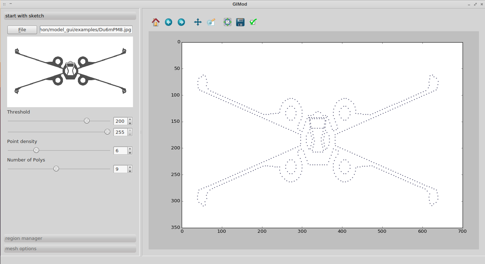
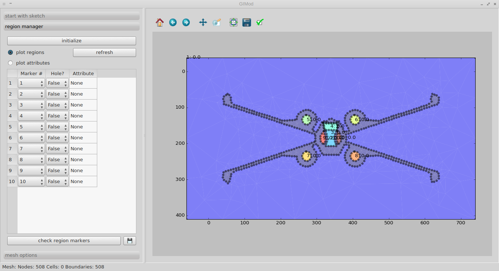
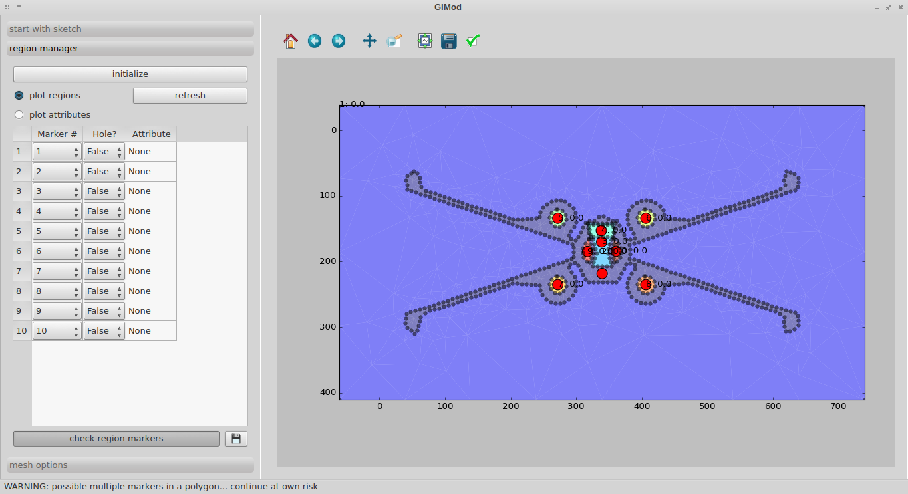
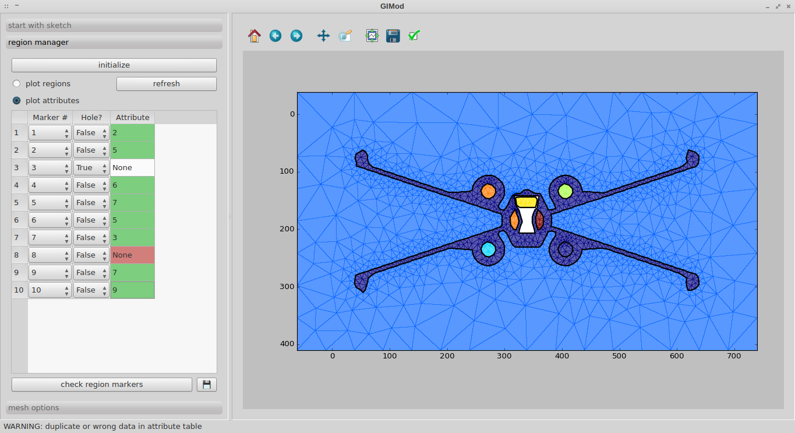
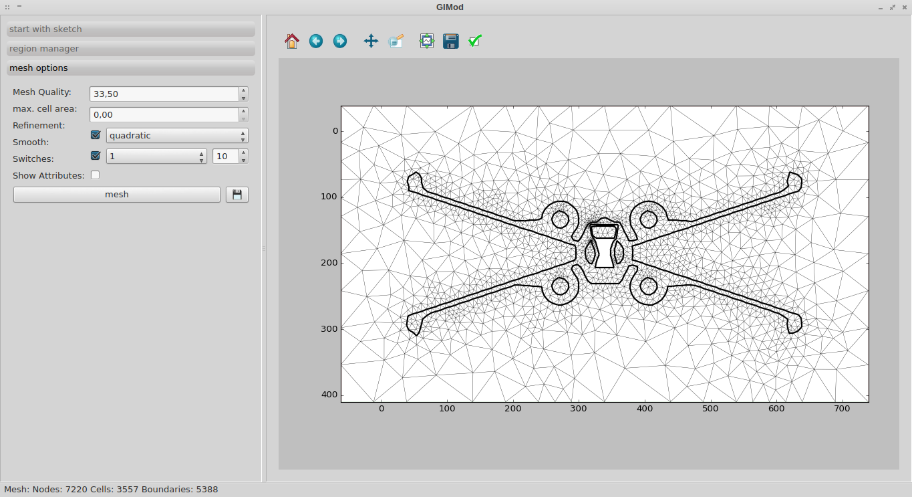

# GIMod
**G**raphical **I**nterface for basic **Mod**el creation

GIMod is intended to make the creation of your basic model with/for [GIMLi](www.pygimli.org) easier. The result is a poly or mesh which can be further used in your own script.

---
## you need:
+ [python](https://www.python.org/downloads/) (written and tested with python 3.5.2)
+ [Qt](https://www.qt.io/download/)
+ [GIMLi](http://www.pygimli.org/installation.html)
+ [OpenCV](http://opencv.org/downloads.html)

### handling
So far it is only possible to start with a sketch/ a picture (png, jpg, etc.) and handle the threshold for a black and white image. The result is the dotted shape of your image. You can adjust the number of polygons found within the shape and adjust the point density (the lower, the denser.. need to fix that).

After this is done the different regions are automatically initialized by click.

There is a possibility that regions overlay each other, so the bottom button activates a mode where you can shift the marker positions for each region manually - click again to update. To the right the small button saves the poly file.

You can also plot the attributes if values are given to the right column.

From the poly file the area can be meshed. Therefore the options from GIMLi are implemented and can be chosen individually (the **switches** part still needs to be done). After building the mesh can be saved via the small button to the right.

## TODO:
+ handfull of todo's and fixme's
+ implement a tab for *drawing* by clicking around
+ get a more suitable example picture
